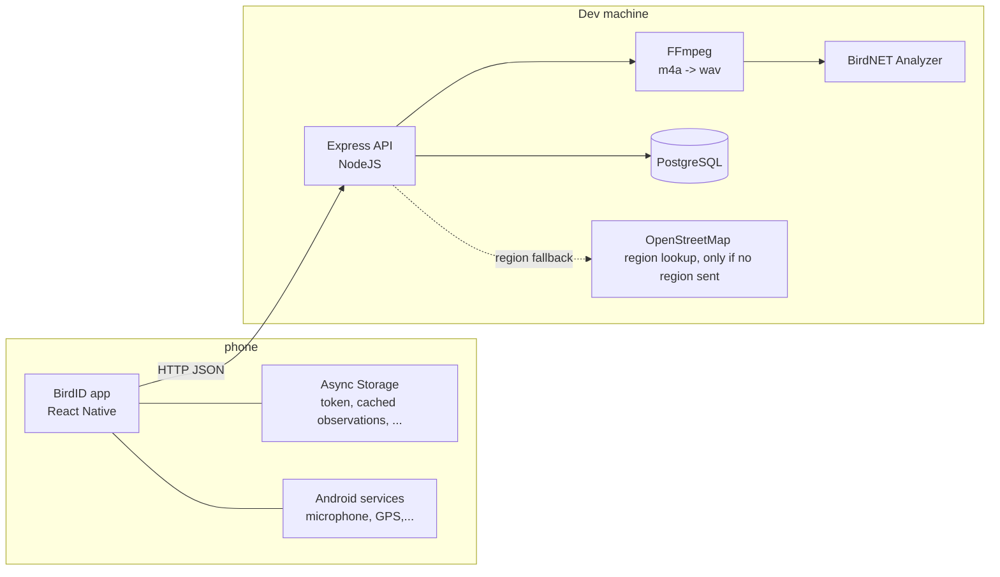

# Birdid architecture
this document described the parts of this project and how they communicate

## components

```mermaid
flowchart LR
    subgraph Phone["phone"]
        APP["BirdID app<br/>React Native"]
        CACHE["Async Storage<br/>token, cached observations, ..."]
        ANDROID["Android services<br/>microphone, GPS,..."]
        APP --- CACHE
        APP --- ANDROID
    end

    subgraph Server["Dev machine"]
        API["Express API<br/>NodeJS"]
        BIRDNET["BirdNET Analyzer"]
        FFMPEG["FFmpeg<br/>m4a -> wav"]
        DB[("PostgreSQL")]
        FALLBACK["OpenStreetMap <br/>region lookup, only if no region sent"]
        API --> FFMPEG
        FFMPEG --> BIRDNET
        API --> DB
        API -. "region fallback" .-> FALLBACK
    end

    APP -- "HTTP JSON" --> API
```