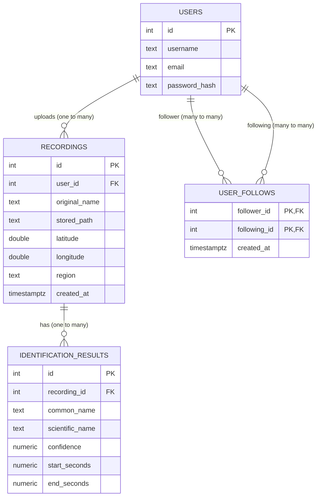

# database
this odcument will describe the database, and the schema

```mermaid
erDiagram
    USERS {
        int id PK
        text username
        text email
        text password_hash
    }
    RECORDINGS {
        int id PK
        int user_id FK
        text original_name
        text stored_path
        double latitude
        double longitude
        text region
        timestamptz created_at
    }
    IDENTIFICATION_RESULTS {
        int id PK
        int recording_id FK
        text common_name
        text scientific_name
        numeric confidence
        numeric start_seconds
        numeric end_seconds
    }
    USER_FOLLOWS {
        int follower_id PK, FK
        int following_id PK, FK
        timestamptz created_at
    }

    USERS ||--o{ RECORDINGS : "uploads (one to many)"
    RECORDINGS ||--o{ IDENTIFICATION_RESULTS : "has (one to many)"
    USERS ||--o{ USER_FOLLOWS : "follower (many to many)"
    USERS ||--o{ USER_FOLLOWS : "following (many to many)"
```
from the readme